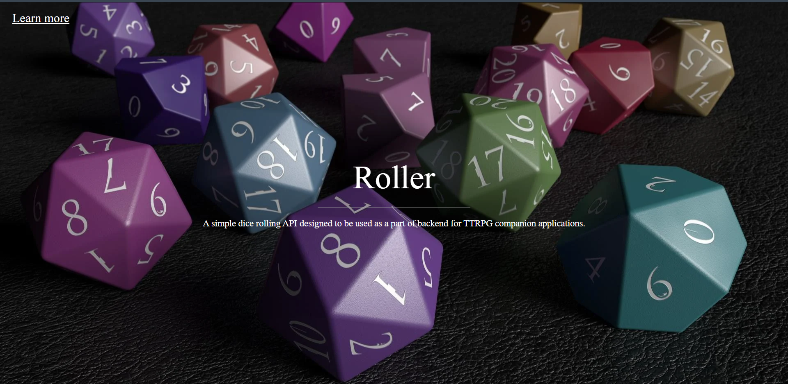

# roller
### Курсовая работа по дисциплине "Java - асинхронные протоколы взаимодействия, распределенная обработка данных, построение 3-х звенной архитектуры".
Простое приложение на фреймворке Spring, предоставляющее легкий доступ различным программам к независимому генератору случайных чисел.

# Функционал
Помимо лендиноговой страницы



Приложение реализует два апи-запроса:

```java
@PostMapping("/roll/{dice}")
public String roll(@PathVariable("dice") Dice dice);

@PostMapping(value = "/rolls", consumes = "application/json")
public String rolls(@RequestBody() Map<Dice, Integer> dice);
```

При помощи простого Python клиента демонстрируется работа приложения:

https://github.com/COOLIRON2311/roller/blob/3c9fe6e818a81f0a5ec0e79fc046d3eb099ad51d/client.py#L1-L27

```shell
D:\Desktop\roller [master]> & C:/Python310/python.exe d:/Desktop/roller/client.py
2
4 + 5 + 1 + 3
```
